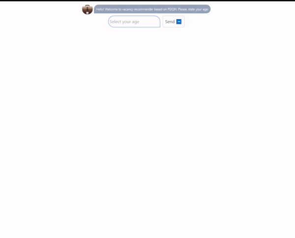

### PDQN interactive UI
---
#### **About:**
This is a web chat-like UI, partly inspired by ChatGPT, built with ReactJS and TailwindCSS that allows interaction between a user and pretrained DQN-based vacancy recommender system. This app can help create custom chat-like interfaces for interacting with not only RL models, but also other deep learning nets that utilize REST API.

#### **Demo:** 
